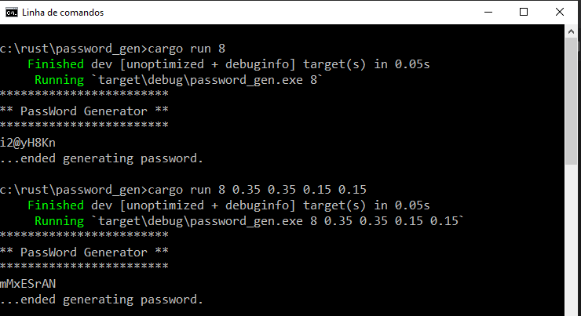

# Password generator in Rust
A simple parameterize console app.

## Description
Password_gen is a console program to generate a random password. 
The password can have n characters of length, the total characters percentage must add to 1.0, it is compose of lower_case_perc, upper_case_perc, numbers_perc signs_perc.

## Screen shoot


## License
MIT Open Source License

# How to

## To compile the final program inside cargo
```
 cargo build --release
```
 
## To execute the program directly do
```
Usage: password_gen length
       password_gen length lower_case_% upper_case_% numbers_% signs_%

ex: password_gen 8
ex: password_gen 8 0.35 0.35 0.15 0.15
```

## To execute the program inside cargo
```
cargo run --release 8
cargo run --release 8 0.35 0.35 0.15 0.15
```

## To generate the docs inside cargo
```
cargo doc
cargo doc --open
```

## Have fun!
Best regards, <br>
Joao Nuno Carvalho <br>
